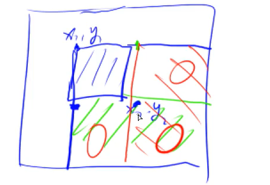

### 高精度
- 加A+B，位数范围 len(A)10^6
- 减A-B，位数范围 len(A)<10^6
- 乘A*b，大整数 len(A)<10^6 乘 小整数b<10^9
- 除A/b，同上

还有
- A*B，快速FFT, NTT(TODO)
- A/B

存储大整数：`a[i]`存第i位数，即“小端”的存储方式。因为进位在末尾补上一个数比较方便

### 前缀和

留出[0]表示空,方便很多操作

2维前缀和:`s[i][j]`, 求`[x1~x2][y1~y2] = s[x2][y2] - s[x1-1][y2] - s[x2][y1-1] + s[x1-1][y1-1]`

T795 前缀和:1维前缀和
T796 子矩阵和:2维前缀和

### 差分

其实也是前缀和的逆运算; 同样留出[0]方便,这样`b[1] = a[1]-a[0] = a[1]`

对偶: a数组是b数组的前缀和，b数组是a数组的差分。类似积分和微分

1维差分：
- 构造：`b[i] = a[i] - a[i-1]`
- 原数组区间[l, r]统一加c： `b[l] += c`和`b[r+1] -= c` 
- 原数组某点值：差分数组求前缀和

2维差分矩阵：构造`b[i][j]`使得`a[i][j]`是其前缀和
- 构造：`b[i][j] = a[i][j] - a[i-1][j] - a[i][j-1] + a[i-1][j-1]` 
- 给`(x1, y1)~(x2, y2)`统一加上c：`b[x1][y1] +=c, b[x1][y2+1] -= c, b[x2+1][y1] -= c, b[x2+1][y2+1] += c` 
  - 注意：差分中的下标+1和前缀和中的下标-1，经常容易忘
- 求原矩阵某点：前缀和



T797 差分
T798 差分矩阵

### 双指针算法

1. 两个序列两个指针：如归并排序
2. 一个序列两个指针：如快排，指向区间

```cpp
for (i = 0, j = 0; i < n; ++i) {
    while (j < i && check(i, j)) j++;   // O(n^2) -> O(n)

    // ...
}
```

T799 最长连续不重复子序列：序列长 n 的范围 1e5， 找出最长的不包含重复数字的连续子序列，输出长度

- 维护区间 `[l, r]` ，枚举r每轮依次向后，每轮中看是否有重复，有重复就将 `l` 也向后移直到没有重复；所以最多就是r移动n，l移动n，最多操作2n，复杂度O(n)

T800 数组元素的目标和：A[]用i，B[]用j，对于每个i，都找一个j使得 A[i] + B[j] >= x，这样当i增加时，j只能减少；时刻维持住即可。初始则i=0,j=m-1


### 位运算

1. 求n的二进制表示中第k位(从0开始，LSB是0)  `(n>>k) & 1`
2. 求n的二进制表示中最低位的1, lowbit(x)


### 离散化

整数保序离散化

值域很大(如$0 \~ 10^9$)，个数较少(如$0 \~ 10^5$)。所以将**大值域映射到小值域中**，方便hash。**离散化到对应坐标**  .

问题：

- 原数组a[]中可能有重复元素 ： 去重
- 如何快速映射: 快速算出 a[i] 离散化为何值： 二分

模板：将所有用过数先存入alls，排序去重，这样alls的下标就可作为离散化后的值（将松弛大的下标离散化为紧凑小的下标)

```cpp
vector<int> alls; // 存储所有待离散化的值
sort(alls.begin(), alls.end());
alls.erase(unique(alls.begin(), alls.end()), alls.end());   // 去掉重复元素
// unique会将区间内重复元素移至末尾，然后返回去重后有效区间的end()；因此之后的erase掉就可以了

// 二分求出x对应的离散化的值
int find(int x) // 找到第一个大于等于x的位置
{
    int l = 0, r = alls.size() - 1;
    while (l < r)
    {
        int mid = l + r >> 1;
        if (alls[mid] >= x) r = mid;
        else l = mid + 1;
    }
    return r + 1; // 映射到1, 2, ...n
}

////////// 对于纯C数组
int alls[N], n;
sort(alls, alls + n);
len = unique(alls, alls + n) - a - 1;

int find(int x) { // 另一种写法
    return lower_bound(alls, alls + len, x) - alls + 1; // 映射到 1, 2, ..., len 所以+1
}

```

T802 区间和 - 离散化：数轴(-10^9 \~ 10^9)即下标，要求区间中数之和；不过能用到的坐标只有3*10^5 (变更操作用1个坐标，询问操作用2个坐标)。值域跨度大，但稀疏

- 前缀和：如果下标范围小
- 即将映射到小范围。用到的只有相对关系，没有绝对关系
- 映射后即可用前缀和思路

### 区间合并

1维区间

- 按区间左端点排序
- 从前向后扫描区间，时刻维护一个[st, ed]区间。则新扫描到的区间会和维护的区间有几种关系，分别更新/记录/即可

T803


### RMQ

区间最值问题，Range Maximum/Minimum Query 

- 本质上是一种动态规划，也称为ST表，跳表
- 用于静态查询

算法
- 预处理获得 `f(i, j)`:表示从i开始，长度是$2^j$的区间中的最大值
  - 递推公式 `f(i, j) = max(f(i, j-1) + f(i+2^{j-1}, j-1))`
  - 状态转移为O(1)，第一维是n个，第二维是logn个，所以总复杂度是O(nlogn)
- 查询：对于[l, r]区间
  - 寻找k，使得$2^k$为**小于等于区间长len**(=r-l+1)的最大的数
  - 这样的话，则两个$2^k$的区间就能覆盖len，那么选l开始和r结尾的两个即可再求max得到解
    - k可以预先计算，或者使用math库中的log计算（`log`是以10为底的，不过还有`log2() log10()`这种）
  - 即 query(l, r) = f(l, k), f(r - 2^k + 1, k) 复杂度是O(1)

比较：RMQ简短，且相比于线段树常数小一些；不过RMQ不支持修改，毕竟有太多个f(i,j)包含某个点了

T1273 天才的记忆：内容即为静态的区间查询，查询最大值

bug: `1<<j-1`写成了`2<<j-1`导致了问题

### 递推与递归

递推：最终可以发现，状态可以递推着求出；开关灯，扫雷

T95 费解的开关：开关灯游戏，要求确定状态是否能在6步内全亮
- 法1：暴力BFS，看看从全1倒推6步能出哪些状态，存表中即可；合法性：状态数其实有限
- 法2：递推，其实只要第一行开关被锁死（不能按），便可从第一行灯看起递推着确定剩下开关的状态
  - 先调第一行开关，第1行总状态数： 2^5；然后开始递推
  - 总共25个开关，每个开关影响5个数据，共500个测试数据，所以复杂度是 O(2^5 * 25 * 5 * 500) = 2e6
- 法3：高斯消元 O(n^6)，n表示边长，则此处就是 5 ^ 6 = 25 * 625 = 1e5 