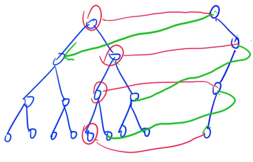

## 可持久化数据结构

可持久化前提：本身的拓扑结构不变

- 可行：线段树，树状数组，堆，trie树
- 不可行：标准平衡树

可持久化的线段树，也称为主席树

**解决的问题**：希望将所有修改的历史版本记录下来（如git操作）

### 基本原理

核心思想：只记录每个版本与前一个版本不一样的地方

#### 可持久化Trie

e.g.  cat, rat, cab, fry  四个历史版本


相同的直接指向，有不一样的需更新就分裂

发现：每次只新加一列分支

#### 256. 最大异或和

非负整数序列a[]

操作1：末尾添加一个数x

操作2：查询在区间[l, r]内的一个位置p，使得从a[p]到尾所有数的异或再与x的异或值最大 

对于操作2，发现维护前缀"和"(异或)同样比较方便

- 记`s[0] = a[0], s[1] = a[0] ^ a[1], s[2] = a[0] ^ a[1] ^ a[2]`，如此一来可以发现`a[p] ^ a[p+1] ^ ... ^ a[N] ^ x = s[p-1] ^ s[N] ^ x` 
  - 后两项固定，目标变为从[l, r]中选择p使得其与`s[N] ^ x`的异或值最大，这就**退化为了T143求最大异或对**了，不过**针对的是前缀异或数组**
  - 但是相比143，这里有了区间[l, r]的限制而非所有数
    - 如果只限制一侧[1, r]，就可以直接用可持久化trie树，查询版本r即可
    - 又加入了[l, ]的左侧限制：相当于问某个子树中，是否存在1个数其下标 ≥ l  $\iff$ 子树中下标的最大值是否≥l：于是**做小小的变化**，在每个trie节点中记录一个max_id记录当前子树中下标的max值
- **前缀异或**可以O(1)维护**区间异或，因而也包含尾缀异或**；**前缀和**可以O(1)维护**区间和**

实现

- 序列长度：3e5个原始数据+3e5个操作 = 6e5 个
- trie树节点个数：1e7 < 2^24的数字范围，即分出最多24个节点，加上每轮可持久化trie的根节点，因而使25 * 6e5
- 通常前缀和都要包括空，因而实际上是 `s[0] = 0, s[1] = a[1], s[2] = a[1] ^ a[2] ...` ，最新2024 T2也让我意识到这点；因而root[0]应初始化为空前缀和的版本；而由于对**前缀异或**来说**0也是合法值**，因此将`max_id[0]`初始化为-1（32个1，24位的数据范围做不到）
- p的范围是[l, r]，但我们要找的是s[p-1]，所以范围应该是[l-1, r-1]


#### 可持久化线段树（主席树）

最基本原理相同：当节点信息发生变化时就分裂出新节点，没变则用之前的。

- 线段树单次操作复杂度最多4logn，则m次操作最多创建O(mlogn)个新节点，即空间代价O(mlogn)，比较小

- 多个版本多个根，显然无法用堆的方式存，只能用指针

  - 指针方式的线段树

    ```cpp
    struct Node {
        int l, r;  // 表示左右子节点的下标，并非左右区间边界了
        int cnt;   // 当前区间中有多少个数
    };
    ```

  - 所有点都是固定的，每次**点修改**更新就是改动从上到下一串路径，分裂这些点就行

- 可持久化线段树难以进行**区间修改**操作：因为难以处理懒标记，更新的点太多了




#### 255. 第K小数

长为N的整数序列A[1\~N]。操作：查询区间[l, r]中第k小的数

经典，有好多做法

- 静态问题：原序列询问中一直不变
  - 归并树 - O(Nlog^3N)
  - 划分树 - 只能解决这类题(区间第k小数) 空间时间都是O(NlogN)
  - 树套树 - 线段树套平衡树，即区间节点中用维护平衡树，不过这个平衡树可使用set  O(Nlog^2N) ，空间复杂度是 O(NlogN) = logN层 * 每层N节点平衡树 ，**支持(第k小数的)修改操作** 
  - 可持久化线段树 - 空间时间都是O(NlogN) ，完全可以取代划分树；**不支持(第k小树的)修改操作**，要支持得加树状数组什么的（相当于树套树了）

算法实现

- 用线段树维护**值域** ；由于值域很大，因而做离散化
- 维护：每个**数值区间中一共有多少个数** 
  - 全值域区间维护cnt：二分
  - [l, r]值域区间维护cnt
    - 找[1, r]区间：利用可持久化线段树，每加一个数是一个版本
    - 再加上左侧l限制：和上一题不同（256是一个存在性为题，所以维护一个信息进行存在性限制即可），可以**利用线段树每个版本的结构完全一样**的特点，再使用**前缀和的思想**。
      - root[L-1]版本中，[l, r]值域区间内的数有cnt1个；root[R]版本中，[l, r]值域区间为cnt2。则在**第L到第R个数(版本)**中[l, r]值域区间有cnt2-cnt1个数
    - 