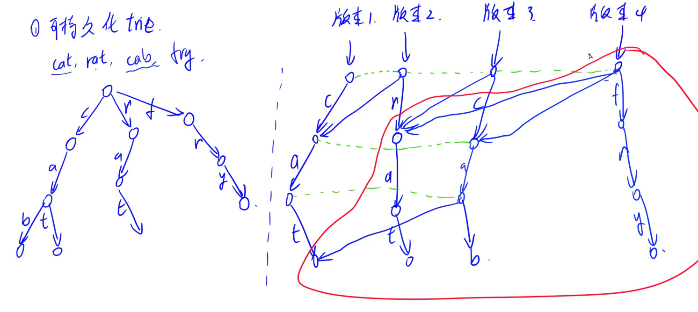

## 可持久化数据结构

可持久化前提：本身的拓扑结构不变

- 可行：线段树，树状数组，堆，trie树
- 不可行：标准平衡树

可持久化的线段树，也称为主席树

**解决的问题**：希望将所有修改的历史版本记录下来（如git操作）

### 基本原理

核心思想：只记录每个版本与前一个版本不一样的地方

#### 可持久化Trie

e.g.  cat, rat, cab, fry  四个历史版本

相同的直接指向，有不一样的需更新就分裂

发现：每次只新加一列分支

### 256. 最大异或和

非负整数序列a[]

操作1：末尾添加一个数x

操作2：查询在区间[l, r]内的一个位置p，使得从a[p]到尾所有数的异或再与x的异或值最大 

对于操作2，发现维护前缀"和"(异或)同样比较方便

- 记`s[0] = a[0], s[1] = a[0] ^ a[1], s[2] = a[0] ^ a[1] ^ a[2]`，如此一来可以发现`a[p] ^ a[p+1] ^ ... ^ a[N] ^ x = s[p-1] ^ s[N] ^ x` 
  - 后两项固定，目标变为从[l, r]中选择p使得其与`s[N] ^ x`的异或值最大，这就**退化为了T143求最大异或对**了，不过**针对的是前缀异或数组**
  - 但是相比143，这里有了区间[l, r]的限制而非所有数
    - 如果只限制一侧[1, r]，就可以直接用可持久化trie树，查询版本r即可
    - 又加入了[l, ]的左侧限制：相当于问某个子树中，是否存在1个数其下标 ≥ l  $\iff$ 子树中下标的最大值是否≥l：于是**做小小的变化**，在每个trie节点中记录一个max_id记录当前子树中下标的max值
- **前缀异或**可以O(1)维护**区间异或，因而也包含尾缀异或**；**前缀和**可以O(1)维护**区间和**

实现

- 序列长度：3e5个原始数据+3e5个操作 = 6e5 个
- trie树节点个数：1e7 < 2^24的数字范围，即分出最多24个节点，加上每轮可持久化trie的根节点，因而使25 * 6e5
- 通常前缀和都要包括空，因而实际上是 `s[0] = 0, s[1] = a[1], s[2] = a[1] ^ a[2] ...` ，最新2024 T2也让我意识到这点；因而root[0]应初始化为空前缀和的版本；而由于对**前缀异或**来说**0也是合法值**，因此将`max_id[0]`初始化为-1（32个1，24位的数据范围做不到）