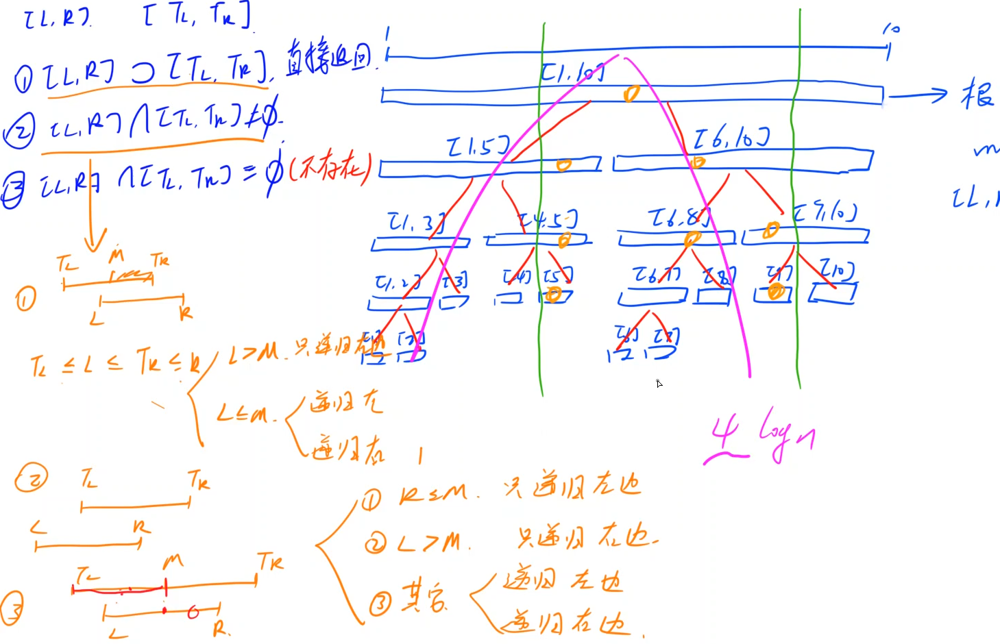
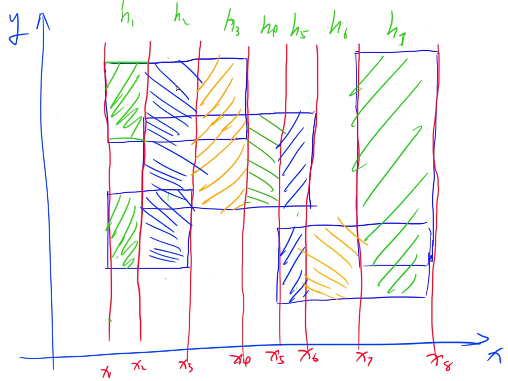
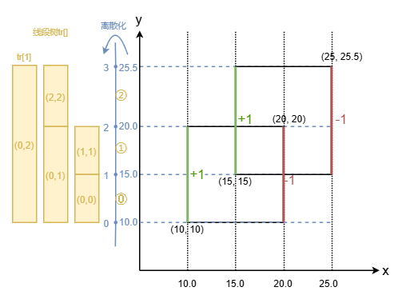

## 线段树

维护区间信息

### 原理

基本操作

- pushup ： 由子节点算父节点区间值
- pushdown ： 将父节点的修改信息下传到子节点，称为懒标记/延迟标记

线段树：除最后一层节点外，都是满二叉树，所以可以类似堆的存储方式，用一维数组存整颗树

- 每层对半分，m = $\lfloor (l + r) / 2 \rfloor$， 然后分为 $[l, m]$ 和 $[m+1, r]$
  - u的左孩子 `u << 1`，u的右孩子 `u << 1 | 1`
- 拆分到单点为止
- 叶节点一定有n个；记线段树中**满二叉树部分**最底层有n节点
  - 最好情况：刚好是满二叉树，就是最后一层n个点，则全树就是2n-1个点
  - 最坏情况下：满二叉树下面一层还有接近满的最后一层，则最后一层最多2n个点，全数最多(2n-1) + 2n = 4n-1个点  （？？？ 怎么有点不对劲，我认为其实应该2n就够呀
  - 一般线段树开空间会开节点数的4倍

最简单的线段树，包含方法

- build() 将一段区间初始化为线段树

  - 根据定义，对半分递归构建
- query(l, r) 查询

  - $[l, r] \supset [T_l, T_r]$ ，即落在节点表示的区间范围内 ，则无需递归直接返回
  - $[l, r] \cap [T_l, T_r] \neq \varnothing$ ，则根据交集位置进行递归，左侧有就向左，右侧有就向右
  - 最开始一定会有交集，随着递归的发生不可能出现两个区间完全不相交（这样就不会去递归它了）
  - 复杂度：对于短区间，可能会正常一个一个看比较慢；但是**查询一次访问的区间数量**为O(logn)
    - 分析递归情况：每种情况递归都不会无限开叉（**仅常数次开叉**），因而访问区间数还会是在O(logn)的量级，常数大概为4，即约4logn的区间数量。**常数有些大**
      
    - 对于情况②-①/②，开叉后一侧必然马上终止，相当于没开叉；对于情况②-③，总可以规约到情况②-①或|和②-②，就最多开叉1次
- modify() 修改单点(易)，某个区间(难)

  - 单点修改：从根向下递归到点，然后回溯时pushup更新父节点的值（重新算一遍即可）
  - 区间修改：最坏情况4n = O(n) ，即最大范围每个区间都要改，这是不好的；于是有了所谓懒删除
    - 从区间查询中学习：访问到完整区间时就可以直接返回，也就是说不用再管下分的子树了；则修改也就修改到此处，仅做一个懒标记，其后的就先不改
    - 懒标记 add: 给**以当前节点为根的子树中的每个节点，加上add**（add一般不包含根节点自己，自行定义），这样修改的复杂度最多 4logn = O(log n)
    - 作用懒标记的时机：query或modify中要向下递归时，需要再进行一次pushdown进行一次作用并情况懒标记；要**保证标记永远适用于整个子区间**
- pushup
- pushdown

扫描线法


### 1275. 最大数

操作1：向序列尾加一个数  => 追加区间似乎不太好做，那么**就事先开好区间** => 在某位置修改一个数

操作2：求后L个数的最大值 => 询问 [n-l+1, n]区间的最大值

因而就能规约到**维护区间最大值的线段树**；

> 同时因为每个位置上的数只修改一次，所以本可以用RMQ倍增做，静态处理
>
> 不过因为输入的数是依赖于之前的操作，属于动态过程，所以不能用RMQ做了

如何确定线段树node中存什么信息：求区间的**某种属性**，一些**辅助信息**（视：当前区间的属性能否有子区间的属性算出，如果不能就可能需要增加）

**修改单点**的线段树，都不需要懒标记；修改区间的就需要，否则会退化

实现

- 注意A操作两数相加可能溢出，对于int来说溢出是负数，取模后仍是复数，则会存入负数；所以应该在相加后强制转换为unsigned int，这样取模后就是正数了：`modify(1, ++n, (unsigned)(x + last) % p)`

### 245. 你能回答这些问题吗

操作1：查询区间中最大连续子段和

操作2：修改单点 => 所以无需懒标记，只需pushup

实现

- 对于构建，最好先读入数组后构建；但感觉也可以当作空线段树一个一个加进去，复杂度没变的，但常数应该翻倍
  - 对于读入数组后统一构建：1379 ms，空间34640 KB
  - 对于空构建再add进数组内容：3592 ms，空间28628 KB
- query时，几种情况返回的值并不是能很好的合并，同样需要维护Node本身新增的一些区间属性；发现其实和pushup的操作类似，于是直接返回Node节点便于利用
- bug1：理解错误，最大连续子段和，维护tr[u]的prefix_max时，就是看取max(左孩子的最大前缀和，左孩子sum+有孩子最大前缀和)，suffix_max同理。我潜意识想错了写成了 `(l.prefix_max == l.sum) ? l.prefix_max + r.prefix_max : l.prefix_max;` 怎么说，就是很难评，就是这么个奇奇怪怪的想错
- bug2：线段树中维护的属性多了，导致赋值时漏赋了一个

错误样例

```
1252  | 1252
1252  | 1252
798   | 798 
1641  | 1034
1547  | 882 
2062  | 1262
2880  | 1720
1967  | 1243
3628  | 3262
1533  | 1533
650   | 650 
4955  | 3593
1742  | 913 
1701  | 1294
5776  | 4540
1349  | 945 
456   | 456 
741   | 470 
5470  | 4643
5805  | 3275
5425  | 4384
5859  | 4565
1243  | 1243
5425  | 4073
5425  | 3105
5642  | 3329
3724  | 3006
-302  | -302
3162  | 2538
3103  | 2274
2392  | 1316
2706  | 2273
4343  | 2243
1689  | 1436
2897  | 2897
2598  | 2273
5873  | 3815
3789  | 2566
1478  | 1120
1653  | 1653
-474  | -474
5905  | 4189
-834  | -834
-908  | -908
-702  | -702
-994  | -994
-883  | -883
-834  | -834
-702  | -702
-702  | -702
-883  | -883
-702  | -702
-702  | -702
-702  | -702
-702  | -702
-702  | -702
-702  | -702
```

### 246. 区间最大公约数

操作1：将区间[l,r]上的值增加d  -> 联想到差分

操作2：询问区间[l, r]的最大公约数

维护最大公约数

- 查询：只需要在区间节点中存最大公约数
- 修改区间：不好改
  - 修改单个数：则方便，递归到底，回溯时重新进行计算即可
  - 则希望转换为差分的形式

又由gcd的性质可知：`gcd(x, y, z) = gcd(x, y-x, z-y)` 辗转相除的原理，所以可以转换为差分。则操作变为**单点修改，区间查询**

```
a[l]      a[l+1]              ... a[r]
b[l]=a[l] b[l+1]=a[l+1]-a[l]  ... b[r]=a[r]-a[r-1]

区间更新 [l, r] 
<=> 更新 a[l], b[l+1] 和 b[r]，然后重新求 gcd(a[l], gcd(b[l+1], b[r]))
<=> 而对于 a[l] 则相当于求b[]的前缀和 a[l] = b[1] + b[2] + ... + b[l]

区间查询
<=> 维护的最大公约数
```

总之全部转换为差分序列维护即可（无需操作1用树状数组，操作2用线段树）

实现

- 线段树中，维护**差分数组**的区间内的**和**与**最大公约数** ；
- 操作1 修改：根据差分数组，调用两次modify，注意尾部越界的话就不用改了
- 操作2 查询：对于[l, r]，需先query(1,l)的区间和，即前缀和，**求出a[l]**；然后再query(l+1, r)部分的gcd值，最终求两者的gcd。原理见上
- pushup还是分两块写好；query时方便对**自定义查询节点**进行pushup

实现2：也可分开写，用**树状数组维护区间修改+单点查询**（差分数组部分），**线段树维护最大公约数**

---


### 243.一个简单的整数问题2

之前是用了树状数组（特殊转化），现在用线段树（自然而然）

操作1：区间修改，加d

操作2：区间查询，区间和

节点维护属性

- sum：考虑当前节点 + **子节点所有标记**，当前区间和是多少；不考虑祖先节点标记
- add：给当前**区间的所有儿子**应该增加的值

### 247. 亚特兰蒂斯

扫描线

目标：求多个长方形(’AABB‘形的)并集的面积总和。

算法：利用积分的思想

- 先选一个方向(比如纵向)，以所有长方形沿该方向上的边作为区间(扫描线)分割；这样每个区间中，就只需要看另一方向。如图所示

    

- 将矩形纵向上的边看作线段；矩形**左侧边线段权值记为+1**（表示这段长度进入"积分"计算），**右侧边线段权值记为-1**（表示这段长度退出”积分“计算）。沿横向x轴**从左向右**，遇到线段相当于一次操作

  - 线段的权值：表示这段区间被几个长方形覆盖到。只要大于0就应该纳入计算

- 因此可以将纵坐标建成线段树，从而转化出两个个操作

  - 操作1：区间修改，将[l, r]区间加k
  - 操作2：区间查询，统计整个区间中权值>0的区间总长
    - **由于扫描线的性质，可以不用到懒标记pushdown**：①我们每次query顶层就能出结果，因此不会向下递归，无需调用pushdown；②区间modify操作总是成对出现的，前+1后必有-1，且+1后此段总会被覆盖直到-1，因为操作不会分裂区间向下递归，对上层区间可用即可，不用管下层区间，也即无需pushdown
  - 线段树节点维护属性：cnt当前区间被覆盖次数（即前述权值），len表示区间内被覆盖(即cnt>0)的长度（不考虑祖先节点，线段树永远只向下看）

- 由于存在小数，要对y作离散化

对于247题的样例输入，演示图如下



实现deug

- 注意子树的小标别写反：笔误写成了[u>>1]了，调了一会儿
- pushup中更新len值：当cnt大于0时，说明此段全都被激活，直接计算即可；如果当cnt=0时，则去看子节点区间中是否有激活段，即左右孩子的len相加，**若没有子节点，即自己为叶节点**，则无药可救了len就是0 <= 这个最后一种情况0的初始化忘记了
- 要用double，用float算完较大的面积数有明显误差（没意识到竟然会真有影响）

### 1277. 维护序列

懒标记复杂