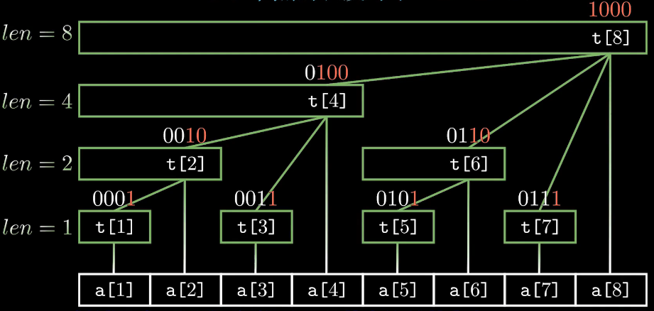

## 树状数组

基本原理；扩展：差分，差分+公式

作用：求前缀和 O(log n)， 修改某个数 O(log n)

- 直接单纯数组：求前缀和O(n)，修改某个数O(1)
- 前缀和数组：求前缀和O(1)，修改某个数O(n)

解决区间和的问题；区间极值就不行

### 基本原理

二进制思想：$x = 2^{i_k} + 2^{i_{k-1}} + \cdots + 2^{i_1}, k \leq \log x, i_k > i_{k-1} > ...$，则对于$[1, x]$ 的区间划分成k部分：

- ①  $(x-2^{i_1}, x]$  包含$2^{i_1}$个数，其中$2^{i_1}$是x的二进制表示的最后一位1
- ②  $(x-2^{i_1}-2^{i_{2}}, x-2^{i_1}]$ 包含$2^{i_2}$个数，其中$2^{i_2}$是$x-2^{i_1}$的二进制表示的最后一位1
- ③  $(x-2^{i_1}-2^{i_2}-2^{i_3}, x-2^{i_1}-2^{i_2}]$ 包含$2^{i_3}$个数, ...
- ...
- k    $(0, x-2^{i_1}-2^{i_{2}}-\cdots-2^{i_{k-1}}]$ 包含$2^{i_k}$个数

可以在logn求出前缀和

(L, R] 区间的长度一定是R的二进制表示的最后一位1

求最后一位1可以用 `lowbit(x) { return x & -x }`，表示仅保留最后一位1后对应的值。于是最终区间可以表示为 `[R - lowbit(R) + 1, R]` 。于是可用 `c[x]` 记录以x为右端点，长度为lowbit(x)的区间



连线是构成关系，然后也可看做树边

```c
(1) c[16] = a[16] + c[15] + c[14] + c[12] + c[8];
(2) c[8]  = a[8]  + c[7]  + c[6]  + c[4];
(3) c[12] = a[12] + c[11] + c[10];         c[4] = a[4] + c[3] + c[2];
...
```

对于x>0，均可一般记为 x = XX100···0(k个0) ；c[x]则为以x结尾的，长度是$2^k$的区间和。计算c[x]

- 首先必有a[x]，剩下需计算$[x-2^k+1, x-1]$的内容，x-1 = XX011···1(k个1)
- 然后可分为k段计算，即每一个1都对应一个儿子。**通过父节点找到所有子节点**

  - e.g. X0|1111 可分为：（1110, **1111**], (1100, **1110**], (1000, **1100**], (0000, **1000**]
  - c[x] = a[x] + c[x-1] + c[x-1-lowbit(x-1)] + ... 直到变为0；即每次去掉最后一个1
- 反向，**通过子节点找到父节点**：重要，对应于修改某个数

  - 即找到所有包含子节点的父节点
  - 修改完一次，直接影响的节点只有1个(说明是树)：parent(x) = x + lowbit(x)
    - 因而迭代向上即可，每迭代一层，末尾0的数量增加一个

#### 操作

修改：子节点找父节点 `for(int i = x; i <= n; i += lowbit(i)) 更新 tr[i];  `

查询：拆分成每一段 `for(int i = x; i > 0; i -= lowbit(i)) res += tr[i];`

初始化：

- 直接一个个加进去 `for(int i = 1; i <= n; i++) add(i, a[i]) `，好比暴力建堆O(nlogn)；但其实这个也够了，一般用到树状数组的复杂度都是O(mlogn)，所以没有增加多少
- 类似Floyd建堆，也有O(n)的方式
  - 对每个x，找所有子节点，只加“树边”：`for (int i = x-1; i; i -= lowbit(i)) c[x] += c[i]` 这样就是n-1次；加上原数组的点a[i]，就是2n-1
  - 对于x，求x的前缀和 `s[x]`，那么根据定义有 `c[x] = s[x] - s[x-lowbit(i)] `，求前缀和O(n)，然后再求c[x]也是O(n)，总共也是O(n)

### 241. 楼兰图腾

思路：可以划分集合，point[k]表示以第k个点(k, y_k)为图腾的底/顶的图腾数量，然后其实可以用乘法原理，算出k左侧和右侧比y_k高(y_k+1 ~ n)的点数，两者相乘即可。

思路中**统计区间和**的操作就可以用树状数组做：稍微对 前缀和 做个变换 [L, R] = [1, R] - [1, L-1]

- `tr[x]` ：即 `c[x]`表示x这个数出现的次数，这样 sum(n) - sum(y) 就是比y大的数的数量， sum(y-1) 就是比y小的数的数量。
  - 这里一开始我没理解清tr是存什么的，疑惑了一会儿；其实就是将y高度hash到了数组坐标，而且因为是整数所以不需要做离散化
- `lower[k]` : 表示1~k-1的数中有多少是小于a[k]的。从左到右一遍，再从右到左一遍则两边的情况就有了
- `higher[k]` : 表示1~k-1中的数有多少是大于a[k]的。同理

实现

- 有可能爆int：两侧都是n，单个k的数量是n^2，然后每个点，所以共有 O(n^3) 的数量级

### 242. 一个简单的整数问题

树状数组变种

- 原本：**单点加+求区间和**。给a[x]加，然后求某一段[l, r]的和
- 变种：**区间加+求单点**。给某一段[l, r]加，然后求a[x]是多少

使用差分：将原数组转换为差分数组。原数组区间加$\iff$差分数组两端做加减；原数组某点值$\iff$ 差分数组求前缀和

- a[l, r]内统一加c $\iff$ b[l] +=c, b[r+1] -= c;
- 求a[x]的值 $\iff$ sum(b[1~x])

差分数组b[]：b[1] = a[1], b[2] = a[2] - a[1], ...

### 243. 一个简单的整数问题2

问题1是：区间加+求单点

问题2则是：**区间加+区间和**

算法

- 区间加：还是使用差分
- 区间和：
  - 先考虑求前缀区间的和
    - $a_1+...+a_x = \sum\limits_{i=1}^x a_i = \sum\limits_{i=1}^x (\sum\limits_{j=1}^{i} b_i) $ 两维的和，即二重循环
      ```
      i = 1: b1
      i = 2: b1 + b2
      i = 3: b1 + b2 + b3
       ...
      i = x: b1 + b2 + b3 + ... + bx
      ```
    - 优化这个二重循环：原本可以写成 `for (int i = 1; i <= x; ++i) { s += b[i], res += s; }`，也就是O(n)
      
      - 从补集的视角看：sum(0, x) = $(b_1+b_2+...+b_x) \cdot (x+1) - (b_1 + 2b_2 + 3b_3 + ... + xb_x)$ 可以发现这就是两个前缀和$\{b_i\}, \{i\cdot b_i \}$ 做好这两个前缀和的维护，就可以O(logn)得出结果
  - 然后区间和就是两个前缀和相减

实现

- 注意爆int的可能性，各处改long long
- 这两个前缀和，可以塞一起更新，不过注意i bi更新时不要误写

### 244. 谜一样的牛

1~n个数乱序，只知道数组A[i]，表示第i个数前面有A[i]个比它小的数；求每一个位置的原数

思考：倒着看A[i]，似乎就能依次确定了

- a[n] = A[n]+1
- a[n-1] = A[n-1] + 1 + [ (a[n] <= A[n-1]) ? 1 : 0 ]
- a[n-2] = A[n-2] + 1 + [ (a[n] <= A[n-2]) ? 1 : 0 ] + [ (a[n-1] <= A[n-2]) ? 1 : 0 ]
- ...

即最原始的做法：一个set记录数字是否确定；从后向前遍历A[i]，a[i]为 未被确定的数中第A[i]个的值

改进一下：初始存一个从A2a的映射数组，从后向前遍历A[i]时，每确定一个a就更新A2a

```
e.g. A[1~5] = 0, 1, 0, 2, 1

[i]  0  1  2  3  4
A2a  1  2  3  4  5
------------------
i = 5:  a[5] = A2a[A[5]] = A2a[1] = 2

  [i]  0  1  2  3  4  =>   [i]  0  1  2  3  4
  A2a  1  2  3  4  5       A2a  1  3  4  5  6
         (x)
  即更新A2a[A[5]~]的值，统一加一；其实都不用更新到尾
------------------
i = 4:  a[4] = A2a[A[4]] = A2a[2] = 4

  [i]  0  1  2  3  4  =>   [i]  0  1  2  3  4
  A2a  1  3  4  5  6       A2a  1  3  5  6  7
            (x)
  即更新A2a[A[4]~]的值
------------------
i = 3:  a[3] = A2a[A[3]] = A2a[0] = 1

  [i]  0  1  2  3  4  =>   [i]  0  1  2  3  4
  A2a  1  3  5  6  7       A2a  2  4  6  7  8
      (x)
  即更新A2a[A[3]~]的值
------------------
...
总结：对于i, a[i] = A2a[A[i]]，然后更新A2a[A[i],]的值+1
若是i偏移至从1开始，则为 a[i] = A2a[A[i]+1]，然后更新A2a[A[i]+1,]的值

```

发现规律，对于这个A2a，就是需要进行**区间更新**（其实是后缀更新），然后需要**求点**，这就可以用树状数组了；不过改树状+差分的话，得把i偏移至从1开始

复杂度

- 如果不用树状数组，每轮需要O(n)，共O(n)轮，O(n^2)要爆
- 用树状数组，每轮更新2 × O(log n)，共O(n)轮，O(n log n)可以

输入样例

```
50
1 1 3 3 1 2 7 2 9 4 2 6 0 5 9 11 16 1 14 20 8 1 2 12 0 20 15 11 22 4 30 8 29 11 0 9 35 26 36 3 6 32 1 19 10 29 30 2 29

```

输出样例

```
13    | 4   check:0
35    | 10        1
31    | 9         1
42    | 18        3
41    | 17        3
14    | 8         1
21    | 13        4 x
43    | 24
18    | 12
46    | 29
25    | 16
17    | 11
27    | 19
5     | 3 
20    | 15
29    | 23
34    | 28
45    | 36
11    | 6 
37    | 31
50    | 40
24    | 19
7     | 5 
8     | 7 
26    | 25
4     | 2 
39    | 34
28    | 27
23    | 22
38    | 34
10    | 9 
49    | 46
16    | 14
44    | 42
19    | 19
1     | 1 
15    | 14
48    | 47
36    | 33
47    | 47
6     | 6 
9     | 9 
40    | 40
2     | 2 
22    | 22
12    | 12
32    | 32
33    | 33
3     | 3 
30    | 30
```

发觉之前的想法是存在问题的，不能转换为其后全加1

---

还有一种优化方式：对于 **从剩余数中找第k小的数** + 删除某数，可以用平衡树写

正确的树状数组转换：对于可选数set，用树状数组维护。即set[1:n]，如果还未被选则为1，被选了则为0，那么前缀和sum(i)就可表示是第几大。

- 删除某数：很自然了
- 难点：找出第k小的数 $\iff$ 找到一个最小的x使得sum(x) = k。似乎就是简单的用二分；二分找点需要O(logn)次，每次求一个点O(logn)，总共n个点，所以复杂度为O(nlog^2n)，由于常数都比较小，其实还可以的

实现

- 其实各种二分的写法并未熟练，还是得自己举点例子才能确定满足需求的 `while()` 处跳出规则和`l, r`的修改规则；而且未必是最高效的（可能会多出1层比较）