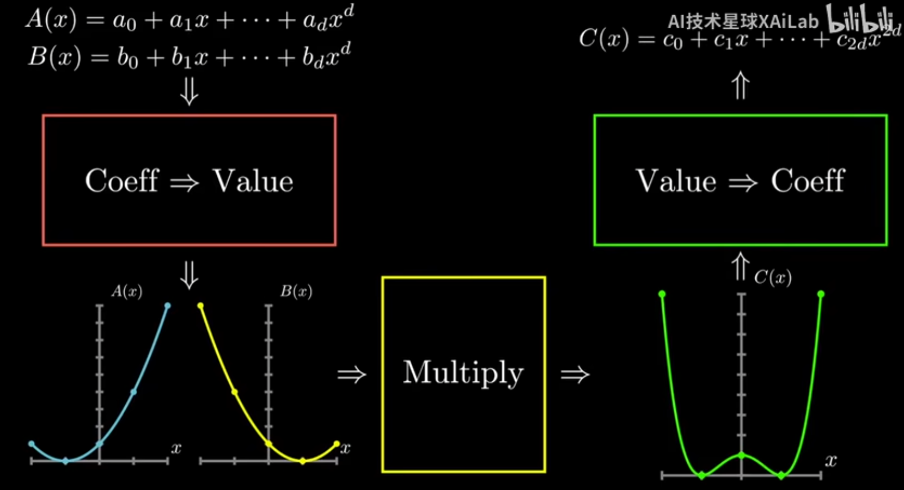

## 快速傅里叶变换

目标：已知多项式$A(x)$和多项式$B(x)$，求$C(x) = A(x)B(x)$ 

### 1 多项式的表示方法

$P(x) = a_0+a_1x^1+a_2x^2+...+a_{n-1}x^{n-1}$ 称为n-1阶(次)多项式

- 系数表示法：$[a_0, a_1,..,a_{n-1}]$ 

- 点值表示法：$\{(x_0,P(x_0)), (x_1,P(x_1)), .., (x_n, P(x_n)) \}$ 易知$n$个点能确定$n-1$阶多项式函数

而在求多项式乘法时，采用表示法计算异常的简单，只需根据$C(x)$的阶数选点，然后带入到$A(x)$和$B(x)$中求乘积即可，若记$C(x)$的阶数为$n-1$，则复杂度仅为$O(n)$；若用一般的系数表示法计算，则复杂度是$O(n^2)$ 

### 2 计算整体思路

两个模块中的转换，用到的均是FFT算法；这整个过程和傅里叶变换的应用过程也很像

- 系数转点值的过程称为**求值**，Evaluation：使用FFT算法

- 点值转系数的过程称为**插值**，Interpolation：使用IFFT，然而我们会发现IFFT和FFT仅极其相似，可复用FFT算法

### 3 求值FFT和插值IFFT的关系

#### 求值FFT

求值的过程，无非是选择点代入计算，虽然看上去简单，但实则要降低复杂度却不容易：利用奇偶性和复数性质，我们有了良好的FFT算法，此处先不表

写成矩阵的形式如下：
$$
\begin{bmatrix} P(x_0)\\P(x_1)\\P(x_2)\\\cdots\\P(x_{n-1}) \end{bmatrix} = 
\begin{bmatrix} 
	1&x_0&x_0^2&\cdots&x_0^{n-1}\\ 1&x_1&x_1^2&\cdots&x_1^{n-1}\\ 1&x_2&x_2^2&\cdots&x_2^{n-1}\\ 
	\vdots&\vdots&\vdots&\ddots&\vdots\\ 1&x_{n-1}&x_{n-1}^2&\cdots&x_{n-1}^{n-1}
\end{bmatrix} 
\begin{bmatrix} a_0\\a_1\\a_2\\\cdots\\a_{n-1} \end{bmatrix}
$$

> 可以发现这个中间的矩阵M是范德蒙德矩阵，所以有$|M|=\prod\limits_{i<j}(x_i-x_j)$，而由于选点的$x_i$各不相同，则有$|M|\neq0$，因此$M$可逆，该方程有唯一解(系数)，所以可由此证明n个点值定n-1阶多项式，点值表示 $\iff$ 系数表示

随后根据FFT算法中的选点$\{x_j\} = \{ 1, \omega^1, \omega^2, .., \omega^{n-1} \ | \ \omega=e^{\frac{2\pi}{n}i} \}$ ，代入上式可得
$$
\begin{bmatrix} P(\omega^0)\\P(\omega^1)\\P(\omega^2)\\\cdots\\P(\omega^{n-1}) \end{bmatrix} = 
\begin{bmatrix} 
	1&1&1&\cdots&1\\ 1&\omega^1&\omega^2&\cdots&\omega^{n-1}\\ 1&\omega^2&\omega^4&\cdots&\omega^{2(n-1)}\\ 
	\vdots&\vdots&\vdots&\ddots&\vdots\\ 1&\omega^{n-1}&\omega^{2(n-1)}&\cdots&\omega^{(n-1)(n-1)}
\end{bmatrix} 
\begin{bmatrix} a_0\\a_1\\a_2\\\cdots\\a_{n-1} \end{bmatrix} = \mathrm{DFT} \cdot \begin{bmatrix} a_0\\a_1\\a_2\\\cdots\\a_{n-1} \end{bmatrix}
$$
此时的范德蒙德矩阵M可以被称为**DFT(Discreate Fourier Transform)矩阵**，而FFT算法也可认为是用于计算 **DFT矩阵和系数乘积** 的算法

#### 插值IFFT

插值的过程，要反推系数，看上去很难，但要是联系求值过程其实就十分简单：即为FFT过程的逆过程

写成矩阵形式如下：
$$
\begin{bmatrix} a_0\\a_1\\a_2\\\cdots\\a_{n-1} \end{bmatrix} 
= \mathrm{DFT}^{-1} \cdot \begin{bmatrix} P(\omega^0)\\P(\omega^1)\\P(\omega^2)\\\cdots\\P(\omega^{n-1}) \end{bmatrix}
= \frac{1}{n} 
\begin{bmatrix} 
	1&1&1&\cdots&1\\ 1&\omega^{-1}&\omega^{-2}&\cdots&\omega^{-(n-1)}\\ 1&\omega^{-2}&\omega^{-4}&\cdots&\omega^{-2(n-1)}\\ 
	\vdots&\vdots&\vdots&\ddots&\vdots\\ 1&\omega^{-(n-1)}&\omega^{-2(n-1)}&\cdots&\omega^{-(n-1)(n-1)}
\end{bmatrix}
\begin{bmatrix} P(\omega^0)\\P(\omega^1)\\P(\omega^2)\\\cdots\\P(\omega^{n-1}) \end{bmatrix}
$$
可以惊喜的发现$\mathrm{DFT}^{-1}$和$\mathrm{DFT}$十分的相似：若记DFT矩阵为$M(\omega)$，则其逆可记为$M(\frac{\omega^{-1}}{n}) = M(\frac{1}{n\omega})$ ，因此只要更换一下$\omega$就可以完全套用FFT的算法了 

