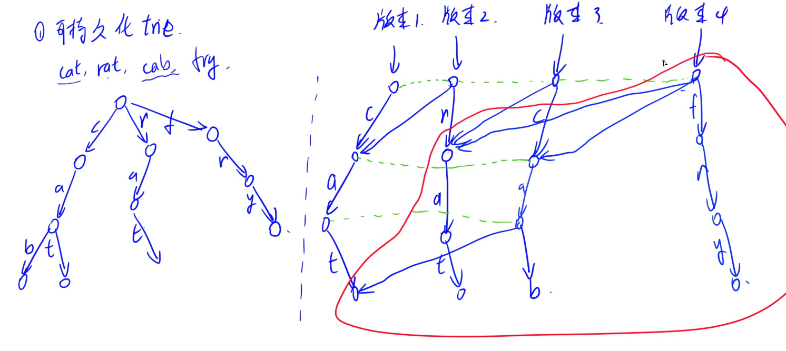

### 基本原理

应用

- 字符串统计
- 将数看作二进制串，可构建为trie树：对**异或运算求最大值**有帮助
	- T143 最大异或对

注意事项
- 容易爆空间，注意事先计算一下
	- trick 如果爆空间，可以根据给定范围反推节点数，一般够用

### 模板

基础版本

```cpp
int tr[N][26], idx = 1;   // p节点: tr[p][ch - 'a'] = ch字符这条边指向的下节点idx
int cnt[N];   // 标记单词 + 记录数量

void init() { idx = 1; }  // 默认idx=0为根节点

void insert(char str[]) {
	int p = 0, u;
	for (int i = 0; str[i]; ++i) {
		u = str[i] - 'a';
		if (!tr[p][u]) tr[p][u] = idx++; // 没有则构造，既保证走的地方都有路
		p = tr[p][u]; // 往下走
	}
	cnt[p]++;
}

void search(char str[]) {
	int p = 0, u;
	for (int i = 0; str[i]; ++i) {
		u = str[i] - 'a';
		if (!tr[p][u]) return 0; // 没路说明没有该单词
		p = tr[p][u]
	}
}
```


可持久化版本

e.g.  cat, rat, cab, fry  四个历史版本



相同的直接指向，有不一样的需更新就分裂

发现：每次只新加一列分支

```cpp
int n, m;
// persistant trie
int root[N];
int tr[M][2], max_id[M], idx;
// prefix xor
int s[N];

void init() { idx = 1; }

// recursive version
void insert(int i, int k, int pre, int cur) { // i: s[i]   k: bit to deal with
    if (k < 0) {
        max_id[cur] = i;
        return;
    }

    int u = s[i] >> k & 1;
    if (pre) tr[cur][u ^ 1] = tr[pre][u ^ 1];
    tr[cur][u] = idx++;
    insert(i, k - 1, tr[pre][u], tr[cur][u]);
    max_id[cur] = max(max_id[tr[cur][0]], max_id[tr[cur][1]]);
}

int query(int rt, int c, int l) { // c = s[n] ^ x, [l, r] : r decides the root[r-1]
    int p = rt, u;
    for (int i = 23; i >= 0; i--) {
        u = c >> i & 1;
        if (max_id[tr[p][u^1]] >= l) p = tr[p][u^1];
        else p = tr[p][u];
    }
    return c ^ s[max_id[p]];
}
```