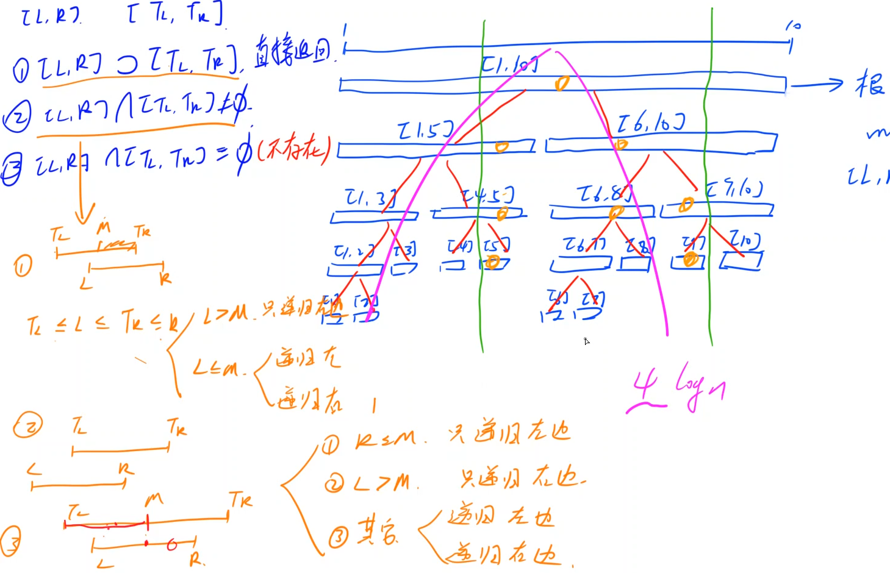
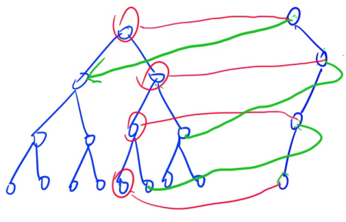
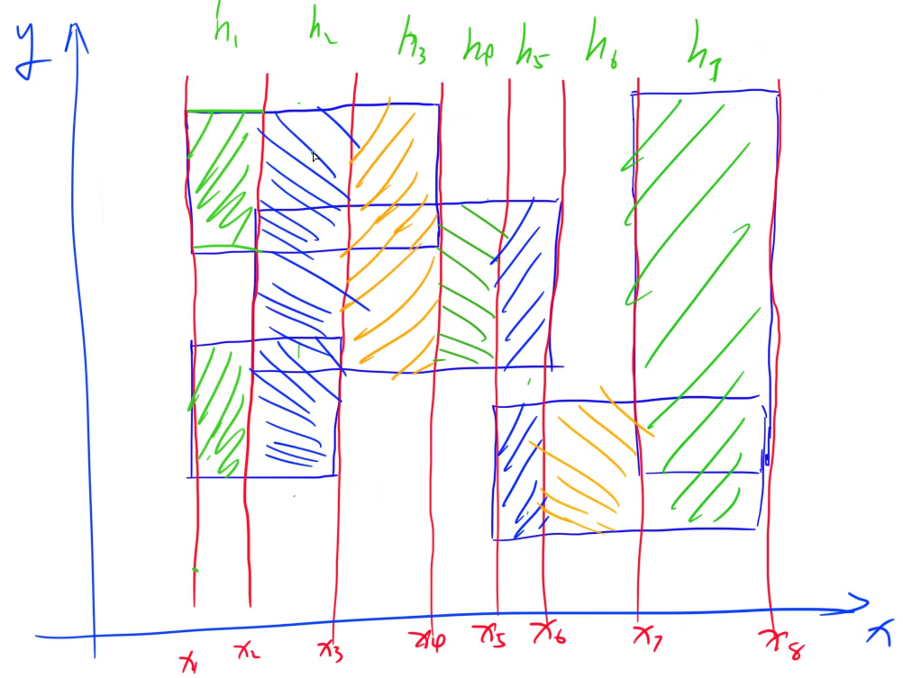
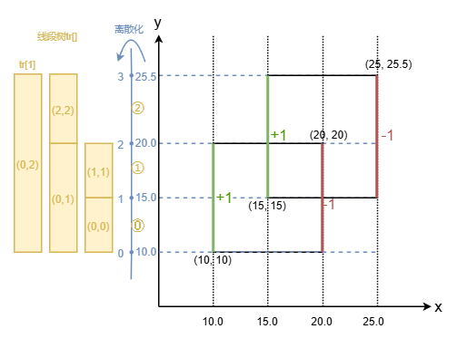

### 基本原理
应用：维护区间信息
- 区间查询+点修改 pushup
- 区间查询+区间修改 pushdown

#### 基本操作

线段树：除最后一层节点外，都是满二叉树，所以可以类似堆的存储方式，用一维数组存整颗树

- 每层对半分，m = $\lfloor (l + r) / 2 \rfloor$， 然后分为 $[l, m]$ 和 $[m+1, r]$
  - u的左孩子 `u << 1`，u的右孩子 `u << 1 | 1`
- 拆分到单点为止
- 叶节点一定有n个；记线段树中**满二叉树部分**最底层有n节点
  - 最好情况：刚好是满二叉树，就是最后一层n个点，则全树就是2n-1个点
  - 最坏情况下：满二叉树下面一层还有接近满的最后一层，则最后一层最多2n个点，全数最多(2n-1) + 2n = 4n-1个点  （？？？ 怎么有点不对劲，我认为其实应该2n就够呀 -> 是指开数组的大小，毕竟只要多一层，由于不知道最后一层节点位置，则那一层就要开满）
    - https://blog.csdn.net/DREAM_yao/article/details/108801613 解释4n-1
  - 一般线段树开空间会开节点数的4倍

最简单的线段树，包含方法

- build() 将一段区间初始化为线段树

  - 根据定义，对半分递归构建
- query(l, r) 查询

  - $[l, r] \supset [T_l, T_r]$ ，即落在节点表示的区间范围内 ，则无需递归直接返回
  - $[l, r] \cap [T_l, T_r] \neq \varnothing$ ，则根据交集位置进行递归，左侧有就向左，右侧有就向右
  - 最开始一定会有交集，随着递归的发生不可能出现两个区间完全不相交（这样就不会去递归它了）
  - 复杂度：对于短区间，可能会正常一个一个看比较慢；但是**查询一次访问的区间数量**为O(logn)
    - 分析递归情况：每种情况递归都不会无限开叉（**仅常数次开叉**），因而访问区间数还会是在O(logn)的量级，常数大概为4，即约4logn的区间数量。**常数有些大**
      
    - 对于情况②-①/②，开叉后一侧必然马上终止，相当于没开叉；对于情况②-③，总可以规约到情况②-①或|和②-②，就最多开叉1次
- modify() 修改单点(易)，某个区间(难)

  - 单点修改：从根向下递归到点，然后回溯时pushup更新父节点的值（重新算一遍即可）
  - 区间修改：最坏情况4n = O(n) ，即最大范围每个区间都要改，这是不好的；于是有了所谓懒删除
    - 从区间查询中学习：访问到完整区间时就可以直接返回，也就是说不用再管下分的子树了；则修改也就修改到此处，仅做一个懒标记，其后的就先不改
    - 懒标记 add: 给**以当前节点为根的子树中的每个节点，加上add**（add一般不包含根节点自己，自行定义），这样修改的复杂度最多 4logn = O(log n)
    - 作用懒标记的时机：query或modify中要向下递归时，需要再进行一次pushdown进行一次作用并情况懒标记；要**保证标记永远适用于整个子区间**
- pushup
- pushdown


### 模板
#### 基础版本
以T243 一个简单的整数问题2 为例
- 维护区间修改：统一加d
- 维护区间查询：区间和

节点维护属性
- sum：考虑当前节点 + **子节点所有标记**，当前区间和是多少；不考虑祖先节点标记
- add：给当前**区间的所有儿子**应该增加的值；先加后乘

```cpp
const int N = 1e5 + 2;
int n, m;
int A[N];
struct Node {
    int l, r;
    ll sum, add;
} tr[N<<2];

#define LCHILD(x) (tr[(x)<<1])
#define RCHILD(x) (tr[(x)<<1|1])

// 进一步分解
inline void pushup(Node& u, Node& l, Node& r) {
    u.sum = l.sum + r.sum;
}
inline void pushup(int u) {
    pushup(tr[u], tr[u<<1], tr[u<<1|1]);
}

inline void pushdown(Node& u, Node& l, Node& r) {
    if (u.add) {
        l.add += u.add; l.sum += (ll)(l.r - l.l + 1) * u.add;
        r.add += u.add; r.sum += (ll)(r.r - r.l + 1) * u.add;
        u.add = 0;
    }
}
inline void pushdown(int u) {
    pushdown(tr[u], tr[u<<1], tr[u<<1|1]);
}

void build(int u, int l, int r) {
    if (l == r) {
        tr[u] = {l, r, A[r], 0};
        return;
    }

    tr[u] = {l, r}; // 容易忘
    int m = l + r >> 1;
    build(u<<1, l, m); build(u<<1|1, m+1, r);
    pushup(u);
}

void modify(int u, int l, int r, ll d) {
    if (l <= tr[u].l && tr[u].r <= r) {
        tr[u].sum += (ll)(tr[u].r - tr[u].l + 1) * d;
        tr[u].add += d;
        return;
    }
    // need seperate
    pushdown(u);
    int m = tr[u].l + tr[u].r >> 1;
    if (l <= m) modify(u<<1, l, r, d);
    if (r >  m) modify(u<<1|1, l, r, d);
    pushup(u);
}

ll query(int u, int l, int r) {
    if (l <= tr[u].l && tr[u].r <= r) return tr[u].sum;

    pushdown(u);
    int m = tr[u].l + tr[u].r >> 1;
    ll sum = 0;
    if (l <= m) sum = query(u<<1, l, r);
    if (r >  m) sum += query(u<<1|1, l, r);
    return sum;
}

#ifdef ANOTHER  // 这是为了某些不存在的区间节点而使用的query，需要返回新节点
Node query(int u, int l, int r) {
	if (l > r) return {0}; // important
    if (l <= tr[u].l && tr[u].r <= r) return tr[u];

    pushdown(u);
    int m = tr[u].l + tr[u].r >> 1;
    if (r <= m) return query(u<<1, l, r);
    if (l >  m) return query(u<<1|1, l, r);
    Node left = query(u<<1, l, r), right = query(u<<1|1, l, r);
    Node res;
    pushup(res, left, right);
    return res;
}
#endif

int main() {
    scanf("%d%d", &n, &m);
    for (int i = 1; i <= n; ++i) scanf("%d", &A[i]);
    build(1, 1, n);

    char op;
    int l, r, d;
    while (m--) {
        scanf(" %c%d%d", &op, &l, &r);
        if (op == 'C') {
            scanf("%d", &d);
            modify(1, l, r, d);
        } else if (op == 'Q') {
            printf("%lld\n", query(1, l, r));
        }
    }

    return 0;
}
```


#### 可持久化版本（主席树）

最基本原理相同：当节点信息发生变化时就分裂出新节点，没变则用之前的。
- 线段树单次操作复杂度最多4logn，则m次操作最多创建O(mlogn)个新节点，即空间代价O(mlogn)，比较小
- 多个版本多个根，显然无法用堆的方式存，只能用指针
  - 指针方式的线段树
    ```cpp
    struct Node {
        int l, r;  // 表示左右子节点的下标，并非左右区间边界了
        int cnt;   // 当前区间中有多少个数
    };
    ```
  - 所有点都是固定的，每次**点修改**更新就是改动从上到下一串路径，分裂这些点就行
- 可持久化线段树难以进行**区间修改**操作：因为难以处理懒标记，更新的点太多了



**T255 求第K小数**为例
长为N的整数序列A[1\~N]。操作：查询区间[l, r]中第k小的数

经典，有好多做法
- 静态问题：原序列询问中一直不变
  - 归并树 - O(Nlog^3N)
  - 划分树 - 只能解决这类题(区间第k小数) 空间时间都是O(NlogN)
  - 树套树 - 线段树套平衡树，即区间节点中用维护平衡树，不过这个平衡树可使用set  O(Nlog^2N) ，空间复杂度是 O(NlogN) = logN层 * 每层N节点平衡树 ，**支持(第k小数的)修改操作** 
  - 可持久化线段树 - 空间时间都是O(NlogN) ，完全可以取代划分树；**不支持(第k小树的)修改操作**，要支持得加树状数组什么的（相当于树套树了）

算法实现
- 用线段树维护**值域** ；由于值域很大，因而做离散化
- 维护：每个**数值区间中一共有多少个数** 
  - 全值域区间维护cnt：二分
  - [l, r]值域区间维护cnt
    - 找[1, r]区间：利用可持久化线段树，每加一个数是一个版本
    - 再加上左侧l限制：和上一题不同（256是一个存在性为题，所以维护一个信息进行存在性限制即可），可以**利用线段树每个版本的结构完全一样**的特点，再使用**前缀和的思想**。
      - root[L-1]版本中，[l, r]值域区间内的数有cnt1个；root[R]版本中，[l, r]值域区间为cnt2。则在**第L到第R个数(版本)**中[l, r]值域区间有cnt2-cnt1个数

```cpp
const int N = 1e5 + 2, M = 1e4 + 2;
constexpr int logN = 17;

int n, m;
int a[N];
vector<int> nums;  // 对值域进行离散化

struct Node {
    int l, r; // idx of left & right sons, not section [l, r]
    int cnt;
} tr[(N<<2) + N*logN];  // 6000,000 * 4B = 24MB
int root[N], idx = 1;

int find(int x) { return lower_bound(nums.begin(), nums.end(), x) - nums.begin(); }

int build(int l, int r) {
    int p = idx++;
    if (l == r) return p;

    int m = l + r >> 1;
    tr[p].l = build(l, m); tr[p].r = build(m+1, r);
    return p;
}

// modify -> insert
int insert(int p, int l, int r, int x) {
    int q = idx++;  // cur: q, pre: p
    tr[q] = tr[p];
    if (l == r) {
        tr[q].cnt++;
        return q;
    }

    int m = l + r >> 1;
    if (x <= m) tr[q].l = insert(tr[p].l, l, m, x);
    else tr[q].r = insert(tr[p].r, m+1, r, x);
    tr[q].cnt = tr[tr[q].l].cnt + tr[tr[q].r].cnt;
    return q;
}

// query
int query(int p, int q, int l, int r, int k) {
    if (l == r) return r;

    int cnt = tr[tr[q].l].cnt - tr[tr[p].l].cnt;
    int m = l + r >> 1;
    if (k <= cnt) return query(tr[p].l, tr[q].l, l, m, k);
    else return query(tr[p].r, tr[q].r, m+1, r, k-cnt);
}


int main() {
    scanf("%d%d", &n, &m);
    for (int i = 1; i <= n; ++i) {
        scanf("%d", &a[i]);
        nums.push_back(a[i]);
    }
    sort(nums.begin(), nums.end());
    nums.erase(unique(nums.begin(), nums.end()), nums.end());

    root[0] = build(0, nums.size()-1);
    for (int i = 1; i <= n; ++i) 
        root[i] = insert(root[i-1], 0, nums.size()-1, find(a[i]));

    int l, r, k;
    while (m--) {
        scanf("%d%d%d", &l, &r, &k);
        printf("%d\n", nums[query(root[l-1], root[r], 0, nums.size()-1, k)]);
    }
    return 0;
}
```


### 其他题目

### 247 亚特兰蒂斯
扫描线

目标：求多个长方形(’AABB‘形的)并集的面积总和。

算法：利用积分的思想
- 先选一个方向(比如纵向)，以所有长方形沿该方向上的边作为区间(扫描线)分割；这样每个区间中，就只需要看另一方向。如图所示
   
- 将矩形纵向上的边看作线段；矩形**左侧边线段权值记为+1**（表示这段长度进入"积分"计算），**右侧边线段权值记为-1**（表示这段长度退出”积分“计算）。沿横向x轴**从左向右**，遇到线段相当于一次操作
  - 线段的权值：表示这段区间被几个长方形覆盖到。只要大于0就应该纳入计算
- 因此可以将纵坐标建成线段树，从而转化出两个个操作
  - 操作1：区间修改，将[l, r]区间加k
  - 操作2：区间查询，统计整个区间中权值>0的区间总长
    - **由于扫描线的性质，可以不用到懒标记pushdown**：①我们每次query顶层就能出结果，因此不会向下递归，无需调用pushdown；②区间modify操作总是成对出现的，前+1后必有-1，且+1后此段总会被覆盖直到-1，因为操作不会分裂区间向下递归，对上层区间可用即可，不用管下层区间，也即无需pushdown
  - 线段树节点维护属性：cnt当前区间被覆盖次数（即前述权值），len表示区间内被覆盖(即cnt>0)的长度（不考虑祖先节点，线段树永远只向下看）
- 由于存在小数，要对y作离散化

对于247题的样例输入，演示图如下


实现deug
- 注意子树的小标别写反：笔误写成了[u>>1]了，调了一会儿
- pushup中更新len值：当cnt大于0时，说明此段全都被激活，直接计算即可；如果当cnt=0时，则去看子节点区间中是否有激活段，即左右孩子的len相加，**若没有子节点，即自己为叶节点**，则无药可救了len就是0 <= 这个最后一种情况0的初始化忘记了
- 要用double，用float算完较大的面积数有明显误差（没意识到竟然会真有影响）

```cpp
const int N = 1e5 + 2;

int n;
struct Segment {
    double x, y1, y2;
    int v; // value: +1, -1
    bool operator<(const Segment& other) const { return x < other.x; }
} segs[N<<1];

struct Node { // each segment-tree node represent a 'section', even for the leaf node
    int l, r;
    int cnt; 
    double len;
} tr[N<<3]; //  *2*4 = *8

vector<double> alls_y;

int find(double y) {
    return lower_bound(alls_y.begin(), alls_y.end(), y) - alls_y.begin();
}

void pushup(int u) {
    if (tr[u].cnt) tr[u].len = alls_y[tr[u].r + 1] - alls_y[tr[u].l];
    else { // cnt = 0, but children nodes may have len, only if it has (not leaf node)
        if (tr[u].l != tr[u].r) { // has children nodes
            tr[u].len = tr[u<<1].len + tr[u<<1|1].len;
        } else { // leaf node, than it's beyond remedy
            tr[u].len = 0.0;
        }
    }
}

void build(int u, int l, int r) {
    tr[u] = {l, r, 0, 0};
    if (l == r) return;

    int m = l + r >> 1;
    build(u<<1, l, m); build(u<<1|1, m+1, r);
}

void modify(int u, int l, int r, int c) {
    if (l <= tr[u].l && tr[u].r <= r) {
        tr[u].cnt += c;
        pushup(u); // update self if possible
        return;
    }

    int m = tr[u].l + tr[u].r >> 1;
    if (l <= m) modify(u<<1, l, r, c);
    if (r >  m) modify(u<<1|1, l, r, c);
    pushup(u);
}

int main() {
    double x1, y1, x2, y2; int k = 0;
    while (scanf("%d", &n), n) {
        // Read in & Discretize
        alls_y.clear();
        for (int i = 0, j = 0; i < n; ++i) {
            scanf("%lf%lf%lf%lf", &x1, &y1, &x2, &y2);
            segs[j++] = {x1, y1, y2, 1};
            segs[j++] = {x2, y1, y2, -1};
            alls_y.push_back(y1); alls_y.push_back(y2);
        }
        sort(alls_y.begin(), alls_y.end());
        alls_y.erase(unique(alls_y.begin(), alls_y.end()), alls_y.end());
        
        // Operate & Segment Tree
        build(1, 0, alls_y.size()-2);  // 'size() points' means 'size()-1 sections' : [l,r] = [0, size()-2]
        // for point alls_y[0, 1, 2, 3], there are 3 intervals
        // we use interval as leaf node: tr[1] = {0, 2}, tr[1] = {0, 1}, tr[2] = {2, 2}, tr[3] = {0, 0}, tr[4] = {1, 1},
        //      where {0, 0} represents alls_y[0~1], {1, 1} represents alls_y[1~2], {2,2} represents alls_y[2~3] 
        sort(segs, segs + n*2);
        double res = 0.0;
        for (int i = 0; i < n * 2; ++i) {
            if (i > 0) {
                res += tr[1].len * (segs[i].x - segs[i-1].x);
            }
            modify(1, find(segs[i].y1), find(segs[i].y2) - 1, segs[i].v);
        }
        // Output
        printf("Test case #%d\n", ++k);
        printf("Total explored area: %.2lf\n\n", res);
    }
}
```