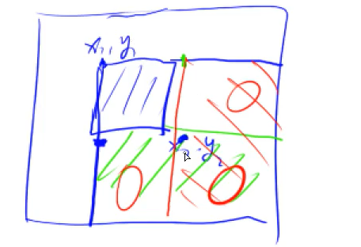

### 注意点
#### 容易敲错
```cpp
for (int i = 0; i < n; ++i)
	for (int j = 0; j < m; ++j) // j打成i，m打成n：集中于后两段
```
#### 复杂度估计
时间复杂度
1. $n \leq 30$，指数级别，dfs+剪枝，状态压缩 dp
2. $n \leq 100$，$O(n^3)$，floyd，dp，高斯消元
3. $n \leq 10000$，$O(n^2)$，$O(n^2 \log n)$，dp，二分，朴素版 Dijkstra，朴素版 Prim，Bellman-Ford
4. $n \leq 100000$，$O(n\sqrt{n})$，快读筛法，分块，莫队
5. $n \leq 1000000$，$O(n)$， 以及常数比较小的 $O(n \log n)$ 算法：sort，树状数组，线段树，set/map，heap，拓扑排序，dijkstra+heap，prim+heap，Kruskal，离线算法，双指针，求某些前缀变，二分，CDQ 分治，整体二分，后缀数组，树链剖分，动态图
6. $n \leq 10000000$，$O(n)$，以及常数较小的 $O(n \log n)$ 算法：单调队列，hash，双指针扫描，BFS，并查集，树状数组，线段树，后缀自动机，动态 DP
7. $n \leq 10^8$，$O(n)$，最小生成树，最短路，kmp，AC 自动机，线性筛素数
8. $n \leq 10^9$，$O(\sqrt{n})$，判断质数
9. $n \leq 10^{18}$，$O(\log n)$，最小公倍数，快速幂，数位 DP
10. $n \leq 10^{100}$，$O((\log n)^2)$，高精度加减乘除
11. $n \leq 10^{100000}$，$O(\log k \log \log k)$，埃拉托色筛法，高精度加减乘，FFT/NTT
空间复杂度估计
```cpp
#
1e6 B = 1 MB

1e6的int数组： 1e6 * 4B = 4MB
512MB: 128 * 1e6 个int数组
64MB:  16  * 1e6 个int数组， 64个 
```
常用估算
```cpp
2^10 = 1024 = 10^3; log(1000) = 10
2^20 = 10^6

log2(2e5) = log2(200) + 10 < 17
```
#### 优先级
正确的写法
```cpp
m = l + r >> 1;    // [*/%] > [+-] > [>><<]
u = s[i] >> k & 1; // [>><<] > [compare] > [equal] > [&] > [^] > [|] 
for (int i = 0; i < 1<<n; ++i) {...} //[>><<] > [compare]
```
#### 常用库使用
```cpp
# 堆序 & 排序; greater<>与less<>
/* less<T> 小的优先 return a < b */
priority_queue<int> pq; // 默认大顶堆
sort(v.begin(), v.end()); sort(a, a+n); // 默认升序
/* greater<T> 大的优先 return a > b */
priority_queue<int, vector<int>, greater<int>> pq; // 小顶堆，反直觉
sort(v.begin(), v.end(), greater<int>()); // 降序

# 优先级队列的清空
pq = {};
pq = priority_queue<int, vector<int>, greater<int>>();

# 自定义结构体与比较器
struct pii {
	int first, second;
	pii() {}
	pii(int v, int w): first(v), second(w) {}
};
sort(v.begin(), v.end(), [](auto& a, auto& b) {
	return a.second < b.second; // 按second升序排列
});
auto cmp = [](auto& a, auto& b) {
	return a.second < b.second; 
} // lambda: 按second升序排列
priority_queue<pii, vector<pii>, greater<pii>> pq;
priority_queue<pii, vector<pii>, decltype(cmp)> pq;
// 方便pair的使用
|#define x first
|#define y second

# memset初始化
memset(a, 0, sizeof a);   // 0
memset(a, -1, sizeof a);  // -1
memset(a,  0x3f, sizeof a); //  0x3f3f3f3f 作为正无穷
memset(a, -0x3f, sizeof a); // -0x3e3e3e3f 可作为负无穷

# nth_element
nth_element(fleet.begin(), fleet.begin() + mid, fleet.end());

# lower_bound和upper_bound: 其实就是用于求有序数组中值在[l, r]区间的个数(指针首尾)
auto it_l = lower_bound(a, a+n, l);  // 大于等于l的最小数
auto it_r = lower_bound(a, a+n, r);  // 大于r的最小数
int cnt = it_r - it_l;  // 都找不到也满足，都是end()
```

----
### 细小知识
#### 离散化
整数保序离散化，将大范围数值映射到小范围，不过查询还是二分查询
```cpp
vector<int> alls; // 存储所有待离散化的值

sort(alls.begin(), alls.end());
alls.erase(unique(alls.begin(), alls.end()), alls.end()); // 去掉重复元素
// unique会将区间内重复元素移至末尾，然后返回去重后有效区间的end()；因此之后的erase掉就可以了
// 二分求出x对应的离散化的值
int find(int x) { // 找到第一个大于等于x的位置
	int l = 0, r = alls.size() - 1;
	while (l < r) {
		int mid = l + r >> 1;
		if (alls[mid] >= x) r = mid;
		else l = mid + 1;
	}
	return r + 1; // 映射到1, 2, ...n
}

////////// 对于纯C数组
int alls[N], n;

sort(alls, alls + n);
len = unique(alls, alls + n) - a - 1;
int find(int x) { // 另一种写法
	return lower_bound(alls, alls + len, x) - alls + 1; 
	// 映射到 1, 2, ..., len 所以+1
}
```


#### 快读
```cpp
// 返回下一个读到的整数
inline int read() {
	int x=0,f=1;char ch=getchar(); 
	while (ch<'0'||ch>'9'){ if (ch=='-') f=-1; ch=getchar(); }
	while (ch>='0'&&ch<='9'){ x=x*10+ch-48; ch=getchar(); }
	return x*f; 
}

// 使用
int a = read();
```

#### 高精度
c++写法

python写法

python基本输入输出
```python
# 一行内指定个数，空格分隔
a, b = map(int, input().split())

# 一行内未知个数，空格分隔
l = list(map(int, input().split()))
l = []; l = input().split()

# 多组数据，没有结束标志
while True:
	try:
		l = list(map(int, input().split()))
		pass
	except:
		break
```
题外话
```cpp
while (scanf("%d", &a), a) { ... }
// scanf失败返回0或EOF(-1)，所以仅用scanf()的返回值不保真
while (cin >> n >> m, n && m) { ... }
```
#### 前缀和 & 差分

> 不一定前缀和，也可前缀最大值，前缀异或等变体，即**前缀运算**
> 留出`[0]`表示空,方便很多操作

2维前缀和:`s[i][j]`, 求`[x1~x2][y1~y2] = s[x2][y2] - s[x1-1][y2] - s[x2][y1-1] + s[x1-1][y1-1]`

1维差分
- 构造：`b[i] = a[i] - a[i-1]`
- 原数组区间[l, r]统一加c： `b[l] += c`和`b[r+1] -= c` 
- 原数组某点值：差分数组求前缀和

2维差分矩阵：构造`b[i][j]`使得`a[i][j]`是其前缀和
- 构造：`b[i][j] = a[i][j] - a[i-1][j] - a[i][j-1] + a[i-1][j-1]` 
- 给`(x1, y1)~(x2, y2)`统一加上c：`b[x1][y1] +=c, b[x1][y2+1] -= c, b[x2+1][y1] -= c, b[x2+1][y2+1] += c` 
  - 注意：差分中的下标+1和前缀和中的下标-1，经常容易忘
- 求原矩阵某点：前缀和



```cpp
// 2维前缀和矩阵
const int N = 1000 + 2;
int n, m, q;
int s[N][N];

int main() {
    ios::sync_with_stdio(false); cin.tie(nullptr);
    cin >> n >> m >> q;
    int a;
    for (int i = 1; i <= n; ++i) {
        for (int j = 1; j <= m; ++j) {
            cin >> a;
            s[i][j] = s[i-1][j] + s[i][j-1] - s[i-1][j-1] + a;
        }
    }
    int x1, y1, x2, y2;
    while (q--) {
        cin >> x1 >> y1 >> x2 >> y2;
        cout << s[x2][y2] - s[x1-1][y2] - s[x2][y1-1] + s[x1-1][y1-1] << endl;
    }
    return 0;
}
```

```cpp
// 二维差分矩阵
int n, m, q;
int a[N][N], b[N][N];

void insert(int x1, int y1, int x2, int y2, int c) {
    b[x1][y1] += c;
    b[x2+1][y1] -= c;
    b[x1][y2+1] -= c;
    b[x2+1][y2+1] += c;
}

int main() {
    ios::sync_with_stdio(false); cin.tie(nullptr);

    cin >> n >> m >> q;
    for (int i = 1; i <= n; ++i) {
        for (int j = 1; j <= m; ++j) {
            cin >> a[i][j];
            b[i][j] = a[i][j] - a[i-1][j] - a[i][j-1] + a[i-1][j-1];
        }
    }

    int x1, y1, x2, y2, c;
    while (q--) {
        cin >> x1 >> y1 >> x2 >> y2 >> c;
        insert(x1, y1, x2, y2, c);
    }

    for (int i = 1; i <= n; ++i) {
        for (int j = 1; j <= m; ++j) {
            a[i][j] = b[i][j] + a[i-1][j] + a[i][j-1] - a[i-1][j-1];
            cout << a[i][j] << " ";
        }
        cout << endl;
    }
    return 0;
}
```

#### 双指针

T799 最长连续不重复子序列：序列长 n 的范围 1e5， 找出最长的不包含重复数字的连续子序列，输出长度
- 维护区间 `[l, r]` ，枚举r每轮依次向后，每轮中看是否有重复，有重复就将 `l` 也向后移直到没有重复；所以最多就是r移动n，l移动n，最多操作2n，复杂度O(n)
```cpp
int n;
int a[N];
int st[N];
int main() {
    ios::sync_with_stdio(false); cin.tie(nullptr);
    cin >> n;
    for (int i = 0; i < n; ++i) cin >> a[i];
    
    int res = 0;
    for (int r = 0, l = 0; r < n; ++r) {
        st[a[r]]++;
        while (st[a[r]] > 1) {  // means has duplication
            st[a[l++]]--; // l would not move back
        }
        res = max(res, r - l + 1);
    }
    cout << res << endl;
}
```

T800 数组元素的目标和：A[]用i，B[]用j，对于每个i，都找一个j使得 A[i] + B[j] >= x，这样当i增加时，j只能减少；时刻维持住即可。初始则i=0,j=m-1

#### 快速幂 & 龟速乘

> 位运算的应用罢了

快速幂 `a^k mod p` 
```cpp
// 乘法实现乘方
int qmi(int a, int k, int p) {
	int res = 1;
	while (k) {
		if (k & 1) res = res * a % p;
		a = a * a % p;
		k >>= 1;
	}
	return res;
}
```

龟速乘 `a*b mod p`
```cpp
// 加法实现乘法 
ll qadd(ll a, ll b, ll p) {
	ll res = 0;
	while (b) {
		if (b & 1) res = (res + a) % p;
		a = (a + a) % p;
		b >>= 1;
	}
	return res;
} // 应对 a * b 爆 uint64_t 的情况: O(logb) python秒了
```

#### 偏移量
常用在二维空间运动，简化写法
```cpp
const int dx[4] = {-1, 0, 1, 0}, dy[4] = {0, 1, 0, -1}; // 上-右-下-左

int a, b;
for (int i = 0; i < 4; ++i) {
	a = x + dx[i], b = y + dy[i];
	...
}
```

#### 滑动窗口
一串数，维护k大小滑动窗口移动，使得时刻O(1)知极值：使用单调队列
```cpp
int a[N]; // 目标数列
int q[N<<2]; // 注意手写queue得大小要足够
int head = 0, tail = -1;

// 合法性判断，队列是否非空: head <= tail，使用队列前必用，队列空了就不能再减了

// 维护滑动窗口最小值 a[q[tail]] >= a[i]
for (int i = 0; i < n; ++i) {
	if (head <= tail && q[head] < i-k+1) head++;  // 队列存的是数得下标
	while (head <= tail && a[q[tail]] >= a[i]) tail--; // 单调队列，弹出>=新数的数
	// 最小的数必然在头上，队列单调增
	q[++tail] = i;

	// 输出更新后窗口内最小值
	if (i >= k-1) printf("%d ", a[q[head]]);
}

```

#### 最大公约数
```cpp
int gcd(int a, int b) {
	return b ? gcd(b, a%b) : a;
}

// 注意负数
abs(gcd(a, b));
```

#### 区间最值问题RMQ
区间最值问题，Range Maximum/Minimum Query 
- 本质上是一种动态规划，也称为ST表，跳表
- 用于静态查询

算法
- 预处理获得 `f(i, j)`:表示从i开始，长度是$2^j$的区间中的最大值
	- 递推公式 `f(i, j) = max(f(i, j-1) + f(i+2^{j-1}, j-1))`
	- 状态转移为O(1)，第一维是n个，第二维是logn个，所以总复杂度是O(nlogn)
- 查询：对于[l, r]区间
	- 寻找k，使得$2^k$为**小于等于区间长len**(=r-l+1)的最大的数
	- 这样的话，则两个$2^k$的区间就能覆盖len，那么选l开始和r结尾的两个即可再求max得到解
	    - k可以预先计算，或者使用math库中的log计算（`log`是以10为底的，不过还有`log2() log10()`这种）
	- 即 query(l, r) = f(l, k), f(r - 2^k + 1, k) 复杂度是O(1)

比较：RMQ简短，且相比于线段树常数小一些；不过RMQ不支持修改，毕竟有太多个f(i,j)包含某个点了

T1273 天才的记忆：内容即为静态的区间查询，查询最大值
```cpp
const int N = 2e5 + 2, M = 18;  // M = log2(N) = log2(2e5)

int n, m;
int w[N];
int f[N][M];

int len2k[N];

void init() {
    // init dp
    for (int j = 0; j < M && (1 << j) <= n; ++j) { // len = 1 << j
        for (int i = 1; i + (1 << j) - 1 <= n; ++i) {
            if (!j) f[i][j] = w[i];
            else f[i][j] = max(f[i][j-1], f[i+(1<<j-1)][j-1]);
        }
    }

    // init len2k
    int k = 0, nxt = 2;
    for (int len = 1; len <= n; ++len) {
        if (len == nxt) { k++; nxt <<= 1; }
        len2k[len] = k;
    }
}

int query(int l, int r) {
    int len = r - l + 1;
    int k = len2k[len];
    // int k = log2(len);
    return max(f[l][k], f[r-(1<<k)+1][k]);
}

int main() {
    scanf("%d", &n);
    for (int i = 1; i <= n; ++i) scanf("%d", &w[i]);

    init();
    scanf("%d", &m);
    int l, r;
    while (m--) {
        scanf("%d%d", &l, &r);
        printf("%d\n", query(l, r));
    }

    return 0;
}
```

bug: `1<<j-1`写成了`2<<j-1`导致了问题


#### 高精度具体
加减
```cpp
const int N = 1e6 + 2;
#define SUB

/*=== A + B ===*/
vector<int> add(vector<int>& A, vector<int>& B) {
    vector<int> C;
    int t = 0;
    for (int i = 0; i < A.size() || i < B.size(); ++i) {
        if (i < A.size()) t += A[i];
        if (i < B.size()) t += B[i];
        C.push_back(t % 10);
        t /= 10;
    }
    if (t) C.push_back(1);
    return C;
}

/*=== A - B ===*/
// A >= B 
bool compare(vector<int>& A, vector<int>& B) {
    if (A.size() != B.size()) return A.size() > B.size();
    for (int i = A.size() - 1; i >= 0; --i)
        if (A[i] != B[i]) 
            return A[i] > B[i];
    return true;
}

// assume A >= B
vector<int> sub(vector<int>& A, vector<int>& B) { 
    vector<int> C;
    int t = 0;
    for (int i = 0; i < A.size(); ++i) {
        t = A[i] - t;
        if (i < B.size()) t -= B[i];
        C.push_back((t + 10) % 10);
        t = (unsigned)t >> 31; // t = (t < 0) ? 1 : 0;
    }
    // clear leading zero
    while (C.size() > 1 && C.back() == 0) C.pop_back();
    return C;
}

int main() {
    string a, b;
    vector<int> A, B;
    cin >> a >> b;
    for (int i = a.size() - 1; i >= 0; --i) A.push_back(a[i] - '0');
    for (int i = b.size() - 1; i >= 0; --i) B.push_back(b[i] - '0');

#ifdef ADD
    auto C = add(A, B);
    for (int i = C.size() - 1; i >= 0; --i) printf("%d", C[i]);
    puts("");
#endif

#ifdef SUB
    bool pos;
    auto C = (pos = compare(A, B)) ? sub(A, B) : sub(B, A);
    if (!pos) printf("-");
    for (int i = C.size() - 1; i >= 0; --i) printf("%d", C[i]);
    puts("");
#endif


    return 0;
}
```
乘除
```cpp
#include <iostream>
#include <vector>
#include <algorithm> // reverse()

using namespace std;
const int N = 1e6 + 2;
#define DIV

/*=== A * b = C ===*/
vector<int> mul(vector<int>& A, int b) {
    vector<int> C;
    int t = 0;
    for (int i = 0; i < A.size() || t; ++i) {
        if (i < A.size()) t += A[i] * b;
        C.push_back(t % 10);
        t /= 10;
    }
    while (C.size() > 1 && C.back() == 0) C.pop_back();
    return C;
}

/*=== A / b = C ... r ===*/
vector<int> div(vector<int>& A, int b, int& r) {
    vector<int> C;
    r = 0;
    for (int i = A.size()-1; i >= 0; --i) {
        r = r * 10 + A[i];
        C.push_back(r / b);
        r %= b;
    }
    reverse(C.begin(), C.end());
    while (C.size() > 1 && C.back() == 0) C.pop_back();
    return C;
}

int main() {
    string a; int b;
    cin >> a >> b;
    vector<int> A;
    for (int i = a.size() - 1; i >= 0; --i) A.push_back(a[i] - '0');

#ifdef MUL
    auto C = mul(A, b);
    for (int i = C.size() - 1; i >= 0; --i) printf("%d", C[i]);
    puts("");
#endif

#ifdef DIV
    int r;
    auto C = div(A, b, r);
    for (int i = C.size() - 1; i >= 0; --i) printf("%d", C[i]);
    printf("\n%d\n", r);
#endif

    return 0;
}
```
FTT相关
```cpp
const double PI = acos(-1);

#ifdef USE_STL

#include <complex>
using cd = complex<double>;
// using cf = complex<float>;

#else

template<typename T>
struct complex {
    T x, y;
    complex (T xx = 0, T yy = 0){ x = xx, y = yy; }
    T real() const { return x; }
    friend complex operator+(const complex& a, const complex& b){ return complex(a.x + b.x , a.y + b.y); }
    friend complex operator-(const complex& a, const complex& b){ return complex(a.x - b.x , a.y - b.y); }
    friend complex operator*(const complex& a, const complex& b){ return complex(a.x * b.x - a.y * b.y , a.x * b.y + a.y * b.x); }
    friend complex operator/(const complex& a, const T& b) { return complex(a.x / b, a.y / b); }
    complex& operator*=(const complex& b) { return *this = *this * b; }
    complex& operator/=(const T& b) { return *this = *this / b; }
    // friend complex& operator*=(complex& a, const complex& b) { return a = a * b; }
    // friend complex& operator/=(complex& a, const T& b) { return a = a / b; }
};
using cd = complex<double>;

#endif

void fft(vector<cd>& p, bool invert) {
    int n = p.size(); 
    if (n == 1) return; // P(x) = c : P(w) = c
    // assert((n & (n - 1)) == 0); // assume n is the power of 2

    /* Split to Pe & Po : P(x) = Pe(x^2) + xPo(x^2) */
    vector<cd> pe(n/2), po(n/2);
    for (int i = 0; i < n; i += 2) {
        pe[i>>1] = p[i];
        po[i>>1] = p[i+1];
    }

    /* Recursive Solving */
    fft(pe, invert); // P even
    fft(po, invert); // P odd 

    /* Merge Pe & Po */
    double angle = 2 * PI / n * (invert ? -1 : 1); // invert: still need 1/n
    cd w(1), wn(cos(angle), sin(angle));
    for (int i = 0; (i << 1) < n; i++) {
        // Caculate using Odevity : w^i, w^{i+n/2} are pm paired
        p[i]       = pe[i] + w * po[i];
        p[i + n/2] = pe[i] - w * po[i];
        // invert: make up the 1/n in the end
        if (invert) {
            p[i] /= 2;
            p[i + n/2] /= 2;
        }
        // Next Pair
        w *= wn; 
    }
}

vector<int> mul(vector<int>& A, vector<int>& B) {
    /* Normalize: let total size to be 2^x */
    vector<cd> fa(A.begin(), A.end()), fb(B.begin(), B.end());
    int size = 1;
    int max_size = A.size() + B.size() - 1; // n + m + 1 = (n+1) + (m+1) - 1 
    while (size < max_size) size <<= 1;
    fa.resize(size); fb.resize(size);

    /* Calculate through FFT */
    fft(fa, false);
    fft(fb, false);
    for (int i = 0; i < size; ++i) fa[i] *= fb[i];
    fft(fa, true);

    vector<int> C(size);
    for (int i = 0; i < size; ++i) {
        C[i] = round(fa[i].real());
    }

    /* Back to Number */
#ifdef BACK_TO_NUM
    int system = 10; // for decimal system
    int carry = 0;
    for (int i = 0; i < size; ++i) {
        C[i] += carry;
        carry = C[i] / system;
        C[i] %= system;
    }
    while (C.size() > 1 && C.back() == 0) C.pop_back();
#else
    C.resize(max_size);
#endif
    return C;
}


int main() {
    int n, m;
    scanf("%d%d", &n, &m);

    vector<int> A, B; int v;
    for (int i = 0; i <= n; ++i) {
        scanf("%d", &v);
        A.push_back(v);
    } // order = n, A.size() = n+1
    for (int i = 0; i <= m; ++i) {
        scanf("%d", &v);
        B.push_back(v);
    } // order = m, A.size() = m+1

    auto C = mul(A, B);

    // C.resize(n + m + 1);
    for (int i = 0; i < C.size(); ++i) printf("%d ", C[i]);
    puts("");

    return 0;
}
```